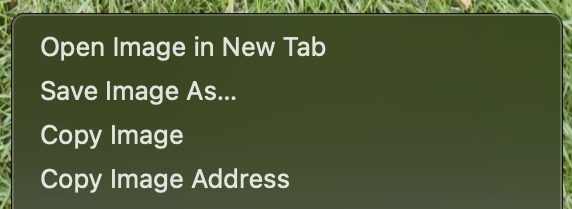
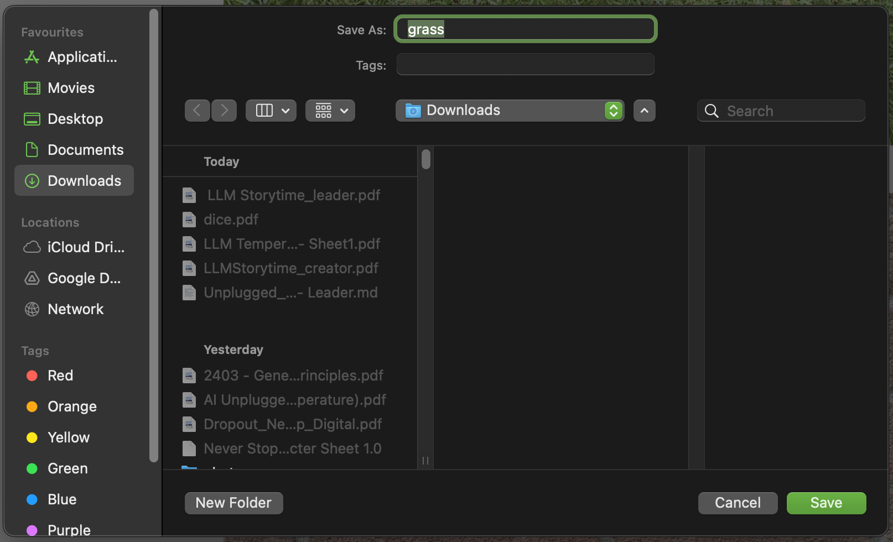

## Making the artwork
Spend about 10-20 mins on the hands-on making.

--- task ---
Creators can draw and craft characters, backgrounds, objects or anything related to thier theme.
--- /task ---

### Take photos
This will be the artwork used for the flatgame, so try to take picture in focus and in a light room 📸 (as much as you can in the space you have!)

--- task ---
Help creators to take photos of thier designs with tablet or phone. If you have a webcam this could work too - and might be easier to get the images in the advice.

Make sure there are no identifiable feature in the photos - such as photos of creators.
--- /task ---

--- task ---
Encourage creators to take photos to add texture or layers to their flatgames. This could be:

- close-up photos 
- photos of textures 
- photos of interesting objects or things

GIF - taking photos
--- /task ---

### Using images on the website

There are a range of images available for creators to upload into their projects in the project instructions. Creators can open the collapse by clicking on it, and then saving the images they like to their scratch folders. 

--- task ---
To use the images in the collapse, creators should right click (two-fingers on Mac) on the image they want to use and choose 'Save Image As'.

--- /task ---

--- task ---

In the popup window, creators should choose the folder you want them to save the images to - something easy to get back to, like `Downloads`or `Documents` is good.
]
--- /task ---

### Painting your own artwork in the Scratch Paint Editor

While it won't have the same collage effect or handmade feel, creators can paint their own artwork using the Scratch Paint editor for costumes and backdrops. 